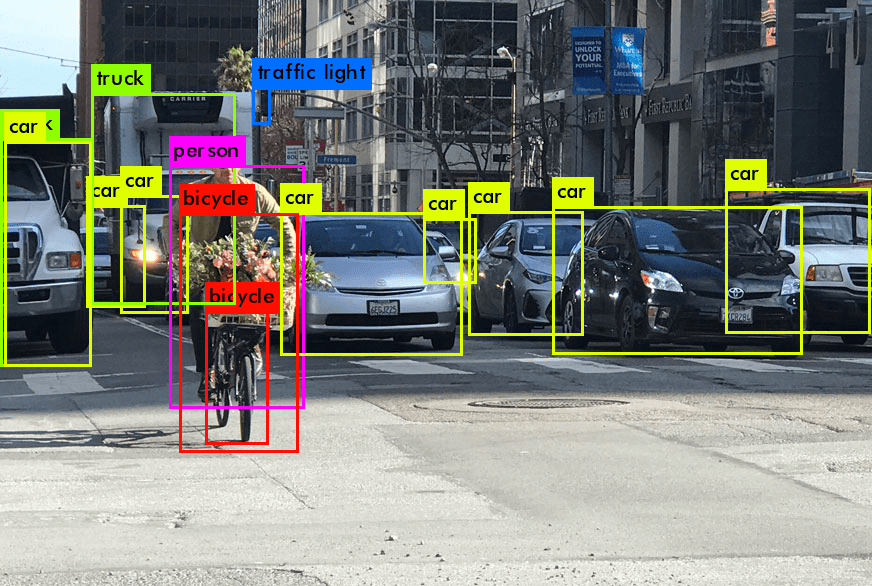

# Car-Detection-
A clean implementation of YOLO (You Only Look Once) for object detection with:
- **Non-Max Suppression (NMS)**
- **Intersection over Union (IoU)**
- **Bounding box visualization**

 

## Features ✨
- ✅ Pre-trained YOLO model (COCO dataset)
- ✅ Efficient NMS implementation
- ✅ IoU calculation for box overlap
- ✅ Real-time detection capable
- ✅ Clean, modular code structure
